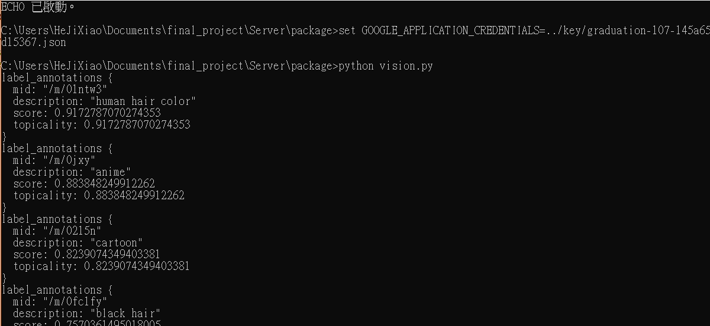

# GCP Application
## Server route ##
URL: [https://graduation-107.appspot.com]( https://graduation-107.appspot.com )
<br>The index is null.

### `/search/<keyword>` ###
Parm :
<br>***keyword*** is *string* variable which be searched on Google
<br>
Return *The format of response is [here](https://developers.google.com/custom-search/json-api/v1/reference/cse/list#response).*The information about every results is in the label "*items*"(title, snippet).

Example <br>
```	
request.get(https://graduation-107.appspot.com/search/cat)
//keyword = cat
````


### `/translation/<text>` ###
Parm :
<br>***text*** is *string* variable which be translated.
<br>
Return : *string*

Example <br>
```	
request.get(https://graduation-107.appspot.com/translate/cat)
//text = cat
````

### `/vision` ###
Parm:
<br> ***Encode on base64 of image***, but you have use the method "POST" in a request.
```python
from base64 import b64encode
with open("../picture.PNG","rb") as img:
print(vision_analytics(b64encode(img.read())))
```
<br>Return :

max_results = 5
```json
request = {
      "image" : {
        "content" : b64decode(img_content)
        },
      "features" : [
        {
          "type" : vision.enums.Feature.Type.LABEL_DETECTION ,
          "max_results": max_results,
        },
        {
          "type" : vision.enums.Feature.Type.LANDMARK_DETECTION ,
          "max_results": max_results,
        },
        {
          "type" : vision.enums.Feature.Type.LOGO_DETECTION ,
          "max_results": max_results,
        },
        {
          "type" : vision.enums.Feature.Type.TEXT_DETECTION ,
          # text detection, document text detection and crop hint do not apply "max_results".
        },
        {
          "type" : vision.enums.Feature.Type.WEB_DETECTION ,
          "max_results": max_results,
        },
      ] 
    }
```
 *The format of response is [here](https://cloud.google.com/vision/docs/reference/rest/v1/images/annotate#AnnotateImageResponse).*